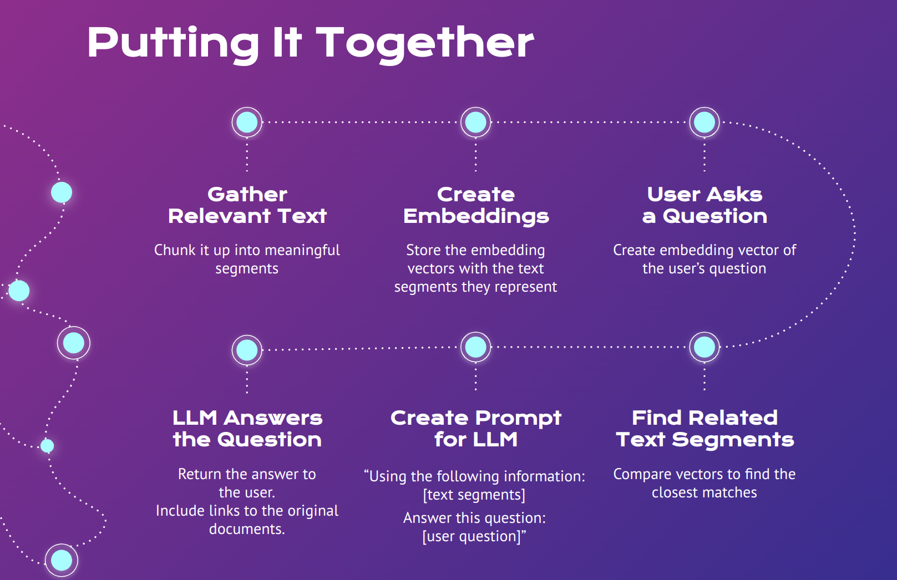

# Code Demo 4: Retrieval-Augmented Generation (RAG)
The scripts in this section demonstrate the process of Retrieval-Augmented Generation, also know as "RAG".

These scripts are part of the demos from the 2nd learning lab in the series:

###"Hack-GPT Part 2: Retrieval-Augmented Generation (RAG)"

See the slides in [presentation](../presentation/) / [HackDiversity Learning Lab - RAG.pdf](../presentation/HackDiversity Learning Lab - RAG.pdf) for and overview of RAG.

The scripts here demonstrate the following:

- [4_01_what_is_an embedding.py](./4_01_what_is_an%20embedding.py): Prompts you to enter some text and calls the OpenAI API to get an embedding for that text. Prints a truncated version of the embedding vector from the API response.
- TODO: describe the remaining scripts

These scripts demonstrate the process outlined in this slide from the deck:

## RAG Process Steps
